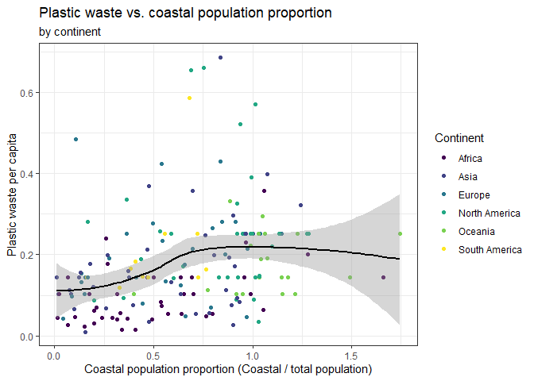

Lab 02 - Plastic waste
================
Linn Zapffe
24/01/2025

## Load packages and data

``` r
library(tidyverse) 
```

``` r
plastic_waste <- read.csv("data/plastic-waste.csv")
```

## Exercises

### Exercise 1

Plotting plastic waste per continent:

``` r
ggplot(data = plastic_waste, mapping = aes(x = plastic_waste_per_cap)) +
  geom_histogram() +
  facet_wrap(~ continent)
```

    ## `stat_bin()` using `bins = 30`. Pick better value with `binwidth`.

    ## Warning: Removed 51 rows containing non-finite values (`stat_bin()`).

<!-- -->

Density plot:

``` r
ggplot(
  data = plastic_waste,
  aes(x = plastic_waste_per_cap)
) +
  geom_density()
```

    ## Warning: Removed 51 rows containing non-finite values (`stat_density()`).

<!-- --> Density plot with
one curve per continent:

``` r
ggplot(
  data = plastic_waste,
  mapping = aes(
    x = plastic_waste_per_cap,
    color = continent
  )
) +
  geom_density()
```

    ## Warning: Removed 51 rows containing non-finite values (`stat_density()`).

<!-- -->

Density plot with one colored-in curve per continent:

``` r
ggplot(
  data = plastic_waste,
  mapping = aes(
    x = plastic_waste_per_cap,
    color = continent,
    fill = continent
  )
) +
  geom_density()
```

    ## Warning: Removed 51 rows containing non-finite values (`stat_density()`).

<!-- --> Changing the
transparency (alpha) so that it is easier to see the overlapping density
curves:

``` r
ggplot(
  data = plastic_waste,
  mapping = aes(
    x = plastic_waste_per_cap,
    color = continent,
    fill = continent
  )
) +
  geom_density(alpha = 0.7)
```

    ## Warning: Removed 51 rows containing non-finite values (`stat_density()`).

<!-- -->

### Exercise 2

Lowering the alpha (transparency) to find a value that leads to an
easily interpretable graph. I ended up liking an alpha of 0.45.

``` r
ggplot(
  data = plastic_waste,
  mapping = aes(
    x = plastic_waste_per_cap,
    color = continent,
    fill = continent
  )
) +
  geom_density(alpha = 0.45)
```

    ## Warning: Removed 51 rows containing non-finite values (`stat_density()`).

<!-- -->

Note to myself: what we add to aes() is what variables we somehow want
to divide up our data by. So there is a difference for each instance.
For example, an axis with all possible scores or a color for each
continent. The things we add in the geom, such as alpha, is the same for
all the data.

### Exercise 3

Box plots divided up by continent:

``` r
ggplot(
  data = plastic_waste,
  mapping = aes(
    x = continent,
    y = plastic_waste_per_cap
  )
) +
  geom_boxplot()
```

    ## Warning: Removed 51 rows containing non-finite values (`stat_boxplot()`).

<!-- -->

Changing the box plots to violin plots:

``` r
ggplot(
  data = plastic_waste,
  mapping = aes(
    x = continent,
    y = plastic_waste_per_cap
  )
) +
  geom_violin()
```

    ## Warning: Removed 51 rows containing non-finite values (`stat_ydensity()`).

<!-- -->

It is a lot easier to see the distributions of the data with the violin
plots than the box plots. With the box plots you have to interpret where
the median is relative to the interquartile values, while for the violin
plots, it is very easy to see whether there is more data for lower or
higher values just by looking at the shape of it. You also see “all” the
scores in the distribution and not just the 5 summary statistics.

### Exercise 4

Making a scatterplot between plastic waste per capita and mismanaged
plastic waste per capita:

``` r
ggplot(data = plastic_waste, mapping = aes(x = plastic_waste_per_cap, y = mismanaged_plastic_waste_per_cap)) + 
  geom_point()
```

    ## Warning: Removed 51 rows containing missing values (`geom_point()`).

<!-- -->

There seems to be a fairly strong positive relationship between plastic
waste per capita and mismanaged plastic waste capita.

Coloring the data points by continent:

``` r
ggplot(data = plastic_waste, mapping = aes(x = plastic_waste_per_cap, y = mismanaged_plastic_waste_per_cap, color = continent)) + 
  geom_point()
```

    ## Warning: Removed 51 rows containing missing values (`geom_point()`).

<!-- -->

There are some differences in the relationship between the variables
based on the continent. For example North America seems to have almost a
curved relationship between these variables. Africa, seem to instead
have a very strong linear association between the variables.

Visualizing plastic waste per capita and total population:

``` r
ggplot(data = plastic_waste, mapping = aes(x = plastic_waste_per_cap, y = total_pop)) + 
  geom_point()
```

    ## Warning: Removed 61 rows containing missing values (`geom_point()`).

<!-- -->

Visualizing plastic waste per capita and coastal population:

``` r
ggplot(data = plastic_waste, mapping = aes(x = plastic_waste_per_cap, y = coastal_pop)) + 
  geom_point()
```

    ## Warning: Removed 51 rows containing missing values (`geom_point()`).

<!-- -->

There doesn’t really seem to be that much of a relationship in any of
these graphs, as the plastic waste per capita is fairly similar
regardless of the total population or coastal population. There is a
chance that there would be a more clear relationship if you removed the
outlier though, as that makes the scale for plastic waste so extended
that it is hard to distinguish the data points that are all clustered
between 0 and 1 for plastic waste per capita. However, if there is a
more clear relationship when removing the outlier this would probably be
stronger for coastal population than total population, as the data for
the total population is mostly centered at either lower or higher values
of total population, with fewer in the middle of the relationship. This
would make it harder to detect a consistent relationship/correlation for
total population compared to coastal population.

### Exercise 5

Testing out the filter code before putting it into the plot:

``` r
filter(plastic_waste, plastic_waste_per_cap < 3)

#plastic_waste %>% filter(plastic_waste_per_cap < 3)
```

I hid the output, since we don’t need 188 rows of data displayed.

Trying to recreate the plot:

``` r
# Loading the library that has the function to change the colors to those in the plot
library(viridis)
```

    ## Warning: package 'viridis' was built under R version 4.3.3

    ## Loading required package: viridisLite

``` r
# Calculating and saving the new variable, coastal proportion. This could also have been done with a pipeline
plastic_waste$coastal_proportion <- plastic_waste$coastal_pop / plastic_waste$total_pop

# Plotting the data
plastic_waste %>% 
  # Only plotting data with plastic waste per capita under 3, to remove outliers
  filter(plastic_waste_per_cap < 3) %>%
    # Making the plot in ggplot
    ggplot(mapping = aes(x = coastal_proportion, y = plastic_waste_per_cap)) +
      # Adding the data points and changing color based on continent
      geom_point(mapping = aes(color = continent)) +
      # Adding the trend line
      geom_smooth(color = "black") +
    # Changing the color scheme of the plot
    scale_color_viridis_d() +
    # Adding labels to the plot
    labs(title = "Plastic waste vs. coastal population proportion",
         subtitle = "by continent",
         x = "Coastal population proportion (Coastal / total population)", y = "Plastic waste per capita",
         color = "Continent") +
          # Changing the theme to remove the background, but keep the grid lines
          theme_bw()
```

    ## `geom_smooth()` using method = 'loess' and formula = 'y ~ x'

    ## Warning: Removed 10 rows containing non-finite values (`stat_smooth()`).

    ## Warning: Removed 10 rows containing missing values (`geom_point()`).

<!-- -->

This is the answer taken from the code of the webpage to compare to my
code. This was retrieved after making the above plot.

``` r
plastic_waste %>%
  mutate(coastal_pop_prop = coastal_pop / total_pop) %>%
  filter(plastic_waste_per_cap < 3) %>%
  ggplot(aes(
    x = coastal_pop_prop,
    y = plastic_waste_per_cap,
    color = continent
  )) +
  geom_point() +
  geom_smooth(color = "black") +
  scale_color_viridis_d() +
  labs(
    x = "Coastal population proportion (Coastal / total population)",
    y = "Plastic waste per capita ",
    color = "Continent",
    title = "Plastic waste vs. coastal population proportion",
    subtitle = "by continent"
  ) +
  theme_minimal()
```

    ## `geom_smooth()` using method = 'loess' and formula = 'y ~ x'

    ## Warning: Removed 10 rows containing non-finite values (`stat_smooth()`).

    ## Warning: Removed 10 rows containing missing values (`geom_point()`).

<!-- -->

After looking at the code used to make the assignment, I have the
following question: Why can the assignment code put continent inside of
aesthetics for ggplot, without getting smooth properties for each
continent, while when I try with this, code, I get a line for each
continent?

After some testing: Apparently, you don’t get one smooth line per
continent if you add color = black to geom_smooth(). I don’t fully
understand why that is the case. Wouldn’t color just make all the lines
black? The next two code blocks show the difference between having color
= “black” or not in geom_smooth().

With color = “black”:

``` r
library(viridis)

plastic_waste$coastal_proportion <- plastic_waste$coastal_pop / plastic_waste$total_pop

plastic_waste %>% 
  filter(plastic_waste_per_cap < 3) %>%
    ggplot(mapping = aes(x = coastal_proportion, y = plastic_waste_per_cap, color = continent)) +
      geom_point() +
      geom_smooth(color = "black") +
    scale_color_viridis_d() +
    labs(title = "Plastic waste vs. coastal population proportion",
         subtitle = "by continent",
         x = "Coastal population proportion (Coastal / total population)", y = "Plastic waste per capita",
         color = "Continent") +
          theme_bw()
```

    ## `geom_smooth()` using method = 'loess' and formula = 'y ~ x'

    ## Warning: Removed 10 rows containing non-finite values (`stat_smooth()`).

    ## Warning: Removed 10 rows containing missing values (`geom_point()`).

<!-- -->

Without color = “black”

``` r
library(viridis)

plastic_waste$coastal_proportion <- plastic_waste$coastal_pop / plastic_waste$total_pop

plastic_waste %>% 
  filter(plastic_waste_per_cap < 3) %>%
    ggplot(mapping = aes(x = coastal_proportion, y = plastic_waste_per_cap, color = continent)) +
      geom_point() +
      geom_smooth() +
    scale_color_viridis_d() +
    labs(title = "Plastic waste vs. coastal population proportion",
         subtitle = "by continent",
         x = "Coastal population proportion (Coastal / total population)", y = "Plastic waste per capita",
         color = "Continent") +
          theme_bw()
```

    ## `geom_smooth()` using method = 'loess' and formula = 'y ~ x'

    ## Warning: Removed 10 rows containing non-finite values (`stat_smooth()`).

    ## Warning: Removed 10 rows containing missing values (`geom_point()`).

<!-- -->

Apart from this, it looks like the only difference between our plots is
that I used theme_bw instead of theme_minimal(). From what I can see,
theme_minimal() also makes the outline of the plot dissappear, which
isn’t the case with theme_bw(). Overall, the plot seem to have been
recreated fairly well.
