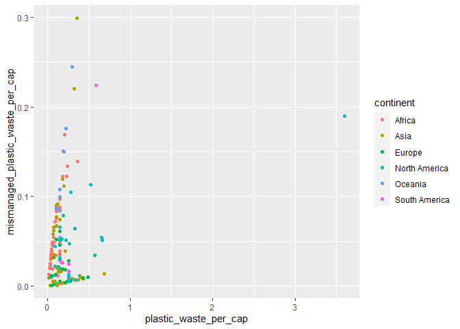
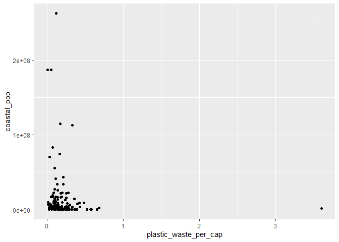

Lab 02 - Plastic waste
================
Linn Zapffe
24/01/2025

## Load packages and data

``` r
library(tidyverse) 
```

``` r
plastic_waste <- read.csv("data/plastic-waste.csv")
```

## Exercises

### Exercise 1

Remove this text, and add your answer for Exercise 1 here.

``` r
ggplot(data = plastic_waste, mapping = aes(x = plastic_waste_per_cap)) +
  geom_histogram() +
  facet_wrap(~ continent)
```

    ## `stat_bin()` using `bins = 30`. Pick better value with `binwidth`.

    ## Warning: Removed 51 rows containing non-finite values (`stat_bin()`).

<!-- -->

``` r
ggplot(
  data = plastic_waste,
  aes(x = plastic_waste_per_cap)
) +
  geom_density()
```

    ## Warning: Removed 51 rows containing non-finite values (`stat_density()`).

<!-- -->

``` r
ggplot(
  data = plastic_waste,
  mapping = aes(
    x = plastic_waste_per_cap,
    color = continent
  )
) +
  geom_density()
```

    ## Warning: Removed 51 rows containing non-finite values (`stat_density()`).

<!-- -->

``` r
ggplot(
  data = plastic_waste,
  mapping = aes(
    x = plastic_waste_per_cap,
    color = continent,
    fill = continent
  )
) +
  geom_density()
```

    ## Warning: Removed 51 rows containing non-finite values (`stat_density()`).

<!-- -->

``` r
ggplot(
  data = plastic_waste,
  mapping = aes(
    x = plastic_waste_per_cap,
    color = continent,
    fill = continent
  )
) +
  geom_density(alpha = 0.7)
```

    ## Warning: Removed 51 rows containing non-finite values (`stat_density()`).

<!-- -->

### Exercise 2

``` r
ggplot(
  data = plastic_waste,
  mapping = aes(
    x = plastic_waste_per_cap,
    color = continent,
    fill = continent
  )
) +
  geom_density(alpha = 0.45)
```

    ## Warning: Removed 51 rows containing non-finite values (`stat_density()`).

<!-- -->

What we add to aes() is what variables we somehow want to divide up our
data by. So there is a difference for each instance. For example, an
axis with all possible scores or a color for each continent. The things
we add in the geom, such as alpha, is the same for all the data.

### Exercise 3

``` r
ggplot(
  data = plastic_waste,
  mapping = aes(
    x = continent,
    y = plastic_waste_per_cap
  )
) +
  geom_boxplot()
```

    ## Warning: Removed 51 rows containing non-finite values (`stat_boxplot()`).

<!-- -->

Changing it to violin plots

``` r
ggplot(
  data = plastic_waste,
  mapping = aes(
    x = continent,
    y = plastic_waste_per_cap
  )
) +
  geom_violin()
```

    ## Warning: Removed 51 rows containing non-finite values (`stat_ydensity()`).

<!-- -->

It is a lot easier to see the distributions with the violing plots than
the box plots. With the box plots you have to interpret where the median
is relative to the interquartiles, while for the violin plots, it is
very easy to see whether there is more data for lower or higher values
just by looking at the shape of it. You also see “all” the scores in the
distribution and not just the 5 summary statistics.

### Exercise 4

Remove this text, and add your answer for Exercise 4 here.

``` r
ggplot(data = plastic_waste, mapping = aes(x = plastic_waste_per_cap, y = mismanaged_plastic_waste_per_cap)) + 
  geom_point()
```

    ## Warning: Removed 51 rows containing missing values (`geom_point()`).

<!-- -->

There doesn’t seem to be that much of a relationship between plastic
waste per capita and mismanaged plastic waste capita. There is a weak
positive relationship. The relationship seems fairly consistent though.

``` r
ggplot(data = plastic_waste, mapping = aes(x = plastic_waste_per_cap, y = mismanaged_plastic_waste_per_cap, color = continent)) + 
  geom_point()
```

    ## Warning: Removed 51 rows containing missing values (`geom_point()`).

<!-- -->

I don’t see any clear distinctions for this relationship based on
continent. Except for the fact that Africa has a very clear (but weak)
positive relationship. The other continents seem to have a relationship
that is a little less consistent.

``` r
ggplot(data = plastic_waste, mapping = aes(x = plastic_waste_per_cap, y = total_pop)) + 
  geom_point()
```

    ## Warning: Removed 61 rows containing missing values (`geom_point()`).

<!-- -->

``` r
ggplot(data = plastic_waste, mapping = aes(x = plastic_waste_per_cap, y = coastal_pop)) + 
  geom_point()
```

    ## Warning: Removed 51 rows containing missing values (`geom_point()`).

<!-- -->

The relationship for both of these graphs is still fairly weak. However,
there seems to be more of a relationship for coastal population, which
has more of a line, than total population, where most of the data is
centered for lower values of the total population and some centered at
higher values, but fewer in the middle of the relationship.

### Exercise 5

Remove this text, and add your answer for Exercise 5 here.

``` r
# insert code here
```
