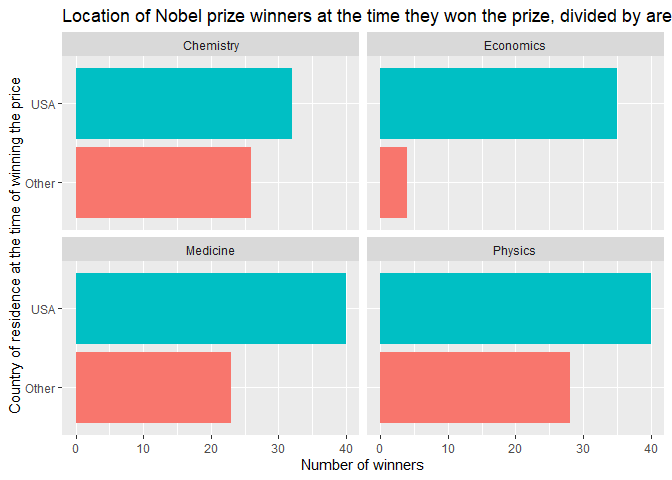
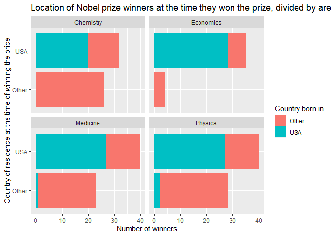

Lab 03 - Nobel laureates
================
Linn Zapffe
28/1/2025

### Load packages and data

``` r
library(tidyverse) 
```

``` r
nobel <- read_csv("data/nobel.csv")
```

## Exercises

### Exercise 1

The data frame has 935 observations and 26 columns. Each row is one
winner of the Nobel price.

### Exercise 2

Making a new data frame called nobel_living, filtering after several
criteria

``` r
nobel_living <- nobel %>%
    # Filter by if they have a country listed
  filter(!is.na(country)) %>%
    # Filter out organizations
  filter(gender != "org") %>%
    # Filter out individuals that are dead
  filter(is.na(died_date))
```

Trying to do the same with one filter statement:

``` r
nobel %>%
    # Filter by several conditions in one argument
  filter(!is.na(country) & gender != "org" & is.na(died_date))
```

    ## # A tibble: 228 × 26
    ##       id firstname   surname  year category affiliation city  country born_date 
    ##    <dbl> <chr>       <chr>   <dbl> <chr>    <chr>       <chr> <chr>   <date>    
    ##  1    68 Chen Ning   Yang     1957 Physics  Institute … Prin… USA     1922-09-22
    ##  2    69 Tsung-Dao   Lee      1957 Physics  Columbia U… New … USA     1926-11-24
    ##  3    95 Leon N.     Cooper   1972 Physics  Brown Univ… Prov… USA     1930-02-28
    ##  4    97 Leo         Esaki    1973 Physics  IBM Thomas… York… USA     1925-03-12
    ##  5    98 Ivar        Giaever  1973 Physics  General El… Sche… USA     1929-04-05
    ##  6    99 Brian D.    Joseph…  1973 Physics  University… Camb… United… 1940-01-04
    ##  7   101 Antony      Hewish   1974 Physics  University… Camb… United… 1924-05-11
    ##  8   103 Ben R.      Mottel…  1975 Physics  Nordita     Cope… Denmark 1926-07-09
    ##  9   106 Samuel C.C. Ting     1976 Physics  Massachuse… Camb… USA     1936-01-27
    ## 10   107 Philip W.   Anders…  1977 Physics  Bell Telep… Murr… USA     1923-12-13
    ## # ℹ 218 more rows
    ## # ℹ 17 more variables: died_date <date>, gender <chr>, born_city <chr>,
    ## #   born_country <chr>, born_country_code <chr>, died_city <chr>,
    ## #   died_country <chr>, died_country_code <chr>, overall_motivation <chr>,
    ## #   share <dbl>, motivation <chr>, born_country_original <chr>,
    ## #   born_city_original <chr>, died_country_original <chr>,
    ## #   died_city_original <chr>, city_original <chr>, country_original <chr>

Both of the above codes worked.

The new data frame has 228 observations.

### Exercise 3

New variable to see whether the winners were in the US when winning the
price

``` r
nobel_living <- nobel_living %>%
  mutate(
    country_us = if_else(country == "USA", "USA", "Other")
  )
```

Creating new variable for area of science

``` r
nobel_living_science <- nobel_living %>%
  filter(category %in% c("Physics", "Medicine", "Chemistry", "Economics"))
```

``` r
ggplot(nobel_living_science, mapping = aes(x = country_us)) +
  geom_bar() +
  facet_wrap(~category) +
  coord_flip()
```

<!-- -->

Most of the winners were in the US when they won, but many of them were
also outside of the US. I don’t know whether looking at only category of
price and where they won the price has anything to say about
immigration. Need more information.

### Exercise 4

``` r
nobel_living_science <- nobel_living_science %>%
  mutate(
    born_country_us = if_else(born_country == "USA", "USA", "Other")
  )
```

Out of the winners, 105 were born in the US and 123 were born in other
countries.

### Exercise 5

``` r
ggplot(nobel_living_science, mapping = aes(x = country_us, fill = born_country_us)) +
  geom_bar() +
  facet_wrap(~category) +
  coord_flip()
```

<!-- -->

Most of the winners in the US were born in the US, but there is a pretty
significant portion of winners that were born other places. I would say
that Buzzfeed has a point about immigrants being good for the research
environment in the US.

### Exercise 6

``` r
nobel_living_science %>% 
  filter(country != "USA" & born_country_us == "Other") %>%
  count(born_country) %>%
  arrange(desc(n))
```

    ## # A tibble: 25 × 2
    ##    born_country       n
    ##    <chr>          <int>
    ##  1 Japan             14
    ##  2 Germany           13
    ##  3 United Kingdom     9
    ##  4 France             7
    ##  5 Switzerland        6
    ##  6 Israel             3
    ##  7 Netherlands        3
    ##  8 Canada             2
    ##  9 India              2
    ## 10 Norway             2
    ## # ℹ 15 more rows

The most common country for immigrants was Japan, with 14 winners.
