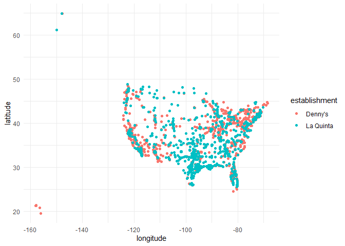
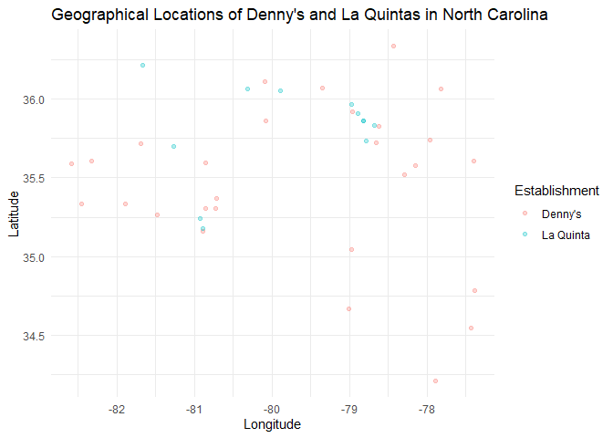
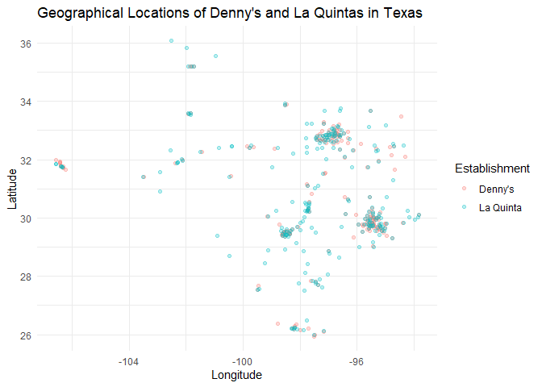

Lab 04 - La Quinta is Spanish for next to Denny’s, Pt. 1
================
Linn Zapffe
29/1/2025

### Load packages and data

``` r
# Ran this code and then commented it out so that it isn't re-run everytime this document is knitted
#install.packages("devtools")
#devtools::install_github("rstudio-education/dsbox")
```

``` r
library(tidyverse) 
library(dsbox) 
```

``` r
states <- read_csv("data/states.csv")
```

### Exercise 1

The dimensions of the Denny’s data set are 1643 rows and 6 columns. Each
row is a Denny’s location and the 6 variables are: address, city, state,
zip, longitude, latitude.

### Exercise 2

The dimensions of the La Quinta data set are 909 rows and 6 columns.
Each row is a La Quinta location and the 6 variables are: address, city,
state, zip, longitude, latitude. These variables are the same as for the
Denny’s locations data set.

### Exercise 3

Whether there are any Denny’s locations outside of the US depends on the
definition. Isn’t Texas its own country? If not, then there are no
Denny’s outside of the US.

La Quinta has locations all over the world, even though most of them are
in the US. The countries are Canada, Mexico, China, New Zealand, Turkey,
United Arab Emirates, Chile, Columbia, and Equador.

### Exercise 4

I would assume the state would be missing if the location is outside of
the US, so I would filter on state being missing.

### Exercise 5

``` r
dennys %>%
  filter(!(state %in% states$abbreviation))
```

    ## # A tibble: 0 × 6
    ## # ℹ 6 variables: address <chr>, city <chr>, state <chr>, zip <chr>,
    ## #   longitude <dbl>, latitude <dbl>

There are no Denny’s locations outside of the US.

### Exercise 6

``` r
dennys <- dennys %>%
  mutate(country = "United States")
```

### Exercise 7

``` r
laquinta %>%
  filter(!(state %in% states$abbreviation))
```

    ## # A tibble: 14 × 6
    ##    address                                  city  state zip   longitude latitude
    ##    <chr>                                    <chr> <chr> <chr>     <dbl>    <dbl>
    ##  1 Carretera Panamericana Sur KM 12         "\nA… AG    20345    -102.     21.8 
    ##  2 Av. Tulum Mza. 14 S.M. 4 Lote 2          "\nC… QR    77500     -86.8    21.2 
    ##  3 Ejercito Nacional 8211                   "Col… CH    32528    -106.     31.7 
    ##  4 Blvd. Aeropuerto 4001                    "Par… NL    66600    -100.     25.8 
    ##  5 Carrera 38 # 26-13 Avenida las Palmas c… "\nM… ANT   0500…     -75.6     6.22
    ##  6 AV. PINO SUAREZ No. 1001                 "Col… NL    64000    -100.     25.7 
    ##  7 Av. Fidel Velazquez #3000 Col. Central   "\nM… NL    64190    -100.     25.7 
    ##  8 63 King Street East                      "\nO… ON    L1H1…     -78.9    43.9 
    ##  9 Calle Las Torres-1 Colonia Reforma       "\nP… VE    93210     -97.4    20.6 
    ## 10 Blvd. Audi N. 3 Ciudad Modelo            "\nS… PU    75010     -97.8    19.2 
    ## 11 Ave. Zeta del Cochero No 407             "Col… PU    72810     -98.2    19.0 
    ## 12 Av. Benito Juarez 1230 B (Carretera 57)… "\nS… SL    78399    -101.     22.1 
    ## 13 Blvd. Fuerza Armadas                     "con… FM    11101     -87.2    14.1 
    ## 14 8640 Alexandra Rd                        "\nR… BC    V6X1…    -123.     49.2

The countries were listed already in question 3, see for reference.

### Exercise 8

``` r
laquinta <- laquinta %>%
  mutate(country = case_when(
    state %in% state.abb ~ "United States",
    state %in% c("ON", "BC") ~ "Canada",
    state == "ANT" ~ "Colombia",
    state %in% c("AG", "QR", "CH", "NL", "VE", "PU", "SL") ~ "Mexico",
    state == "FM" ~ "Honduras"
  ))
```

This countries I found by Googling did not seem to be the same as from
the La Quinta webpage. There was no Honduras on the webpage and there
are a lot of countries on the webpage missing in the data set. My best
guess is that the data set is older than the webpage and not updated
with all the current locations.

``` r
laquinta <- laquinta %>%
  filter(country == "United States")
```

### Exercise 9

``` r
dennys %>%
  count(state) %>%
  arrange(desc(n))
```

    ## # A tibble: 51 × 2
    ##    state     n
    ##    <chr> <int>
    ##  1 CA      403
    ##  2 TX      200
    ##  3 FL      140
    ##  4 AZ       83
    ##  5 IL       56
    ##  6 NY       56
    ##  7 WA       49
    ##  8 OH       44
    ##  9 MO       42
    ## 10 PA       40
    ## # ℹ 41 more rows

There are the most Denny’s locations in California.

``` r
laquinta %>%
  count(state) %>%
  arrange(desc(n))
```

    ## # A tibble: 48 × 2
    ##    state     n
    ##    <chr> <int>
    ##  1 TX      237
    ##  2 FL       74
    ##  3 CA       56
    ##  4 GA       41
    ##  5 TN       30
    ##  6 OK       29
    ##  7 LA       28
    ##  8 CO       27
    ##  9 NM       19
    ## 10 NY       19
    ## # ℹ 38 more rows

There are the most La Quinta locations in Texas.

It is a little surprising that they don’t have the highest number in the
same state, since they are (argued) to always occur together. Other than
that, I don’t know enough about the different states or stereotypes of
the different states to evaluate the specific state further.

### Exercise 10

``` r
dennys %>%
  count(state) %>%
  inner_join(states, by = c("state" = "abbreviation")) %>% 
  mutate(loc_per_mile = area / 1000 / n) %>% 
  arrange(loc_per_mile)
```

    ## # A tibble: 51 × 5
    ##    state     n name                     area loc_per_mile
    ##    <chr> <int> <chr>                   <dbl>        <dbl>
    ##  1 DC        2 District of Columbia     68.3       0.0342
    ##  2 RI        5 Rhode Island           1545.        0.309 
    ##  3 CA      403 California           163695.        0.406 
    ##  4 CT       12 Connecticut            5543.        0.462 
    ##  5 FL      140 Florida               65758.        0.470 
    ##  6 MD       26 Maryland              12406.        0.477 
    ##  7 NJ       10 New Jersey             8723.        0.872 
    ##  8 NY       56 New York              54555.        0.974 
    ##  9 IN       37 Indiana               36420.        0.984 
    ## 10 OH       44 Ohio                  44826.        1.02  
    ## # ℹ 41 more rows

We used inner join here as it found each row that matched (the US
states) and kept the variables from the two data sets from those rows.

There are the most locations of Denny’s per thousand square miles in the
District of Columbia. I didn’t even know that that was a state.

``` r
laquinta %>%
  count(state) %>%
  inner_join(states, by = c("state" = "abbreviation")) %>% 
  mutate(loc_per_mile = area / 1000 / n) %>% 
  arrange(loc_per_mile)
```

    ## # A tibble: 48 × 5
    ##    state     n name             area loc_per_mile
    ##    <chr> <int> <chr>           <dbl>        <dbl>
    ##  1 RI        2 Rhode Island    1545.        0.772
    ##  2 FL       74 Florida        65758.        0.889
    ##  3 CT        6 Connecticut     5543.        0.924
    ##  4 MD       13 Maryland       12406.        0.954
    ##  5 TX      237 Texas         268596.        1.13 
    ##  6 TN       30 Tennessee      42144.        1.40 
    ##  7 GA       41 Georgia        59425.        1.45 
    ##  8 NJ        5 New Jersey      8723.        1.74 
    ##  9 MA        6 Massachusetts  10554.        1.76 
    ## 10 LA       28 Louisiana      52378.        1.87 
    ## # ℹ 38 more rows

There are the most of La Quinta locations per thousand square miles in
Rhode Island.

### Exercise 11

``` r
dennys <- dennys %>%
  mutate(establishment = "Denny's")
laquinta <- laquinta %>%
  mutate(establishment = "La Quinta")
```

``` r
dn_lq <- bind_rows(dennys, laquinta)
```

``` r
ggplot(dn_lq, mapping = aes(
  x = longitude,
  y = latitude,
  color = establishment
)) +
  geom_point()
```

<!-- -->

``` r
dn_lq %>% 
  filter(state == "NC") %>% 
  ggplot(dn_lq, mapping = aes(
    x = longitude,
    y = latitude,
    color = establishment
  )) +
    geom_point(alpha = 0.25) +
  labs(
    title = "Geographical Locations of Denny's and La Quintas in North Carolina",
    color = "Establishment",
    x = "Longitude",
    y = "Latitude"
  )
```

<!-- -->

The joke doesn’t really seem to hold based on the locations in North
Carolina, as there are only a few locations at the same place.

### Exercise 12

``` r
dn_lq %>% 
  filter(state == "TX") %>% 
  ggplot(dn_lq, mapping = aes(
    x = longitude,
    y = latitude,
    color = establishment
  )) +
    geom_point(alpha = 0.25) +
  labs(
    title = "Geographical Locations of Denny's and La Quintas in Texas",
    color = "Establishment",
    x = "Longitude",
    y = "Latitude"
  )
```

<!-- -->

The claim seems more supported in Texas, as there are clusters with
these locations, where several of them seem to overlap (i.e. being in
the same location).
