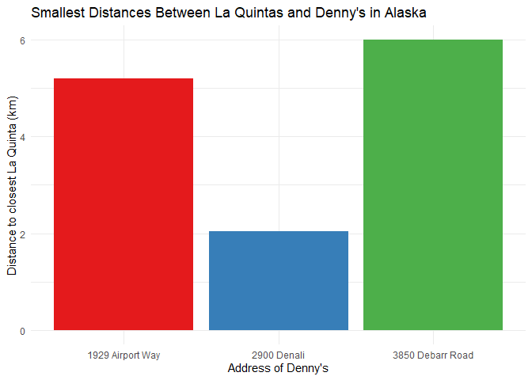
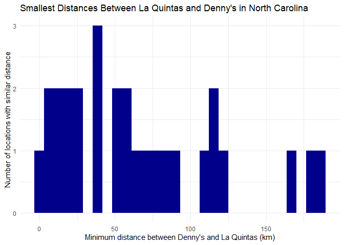
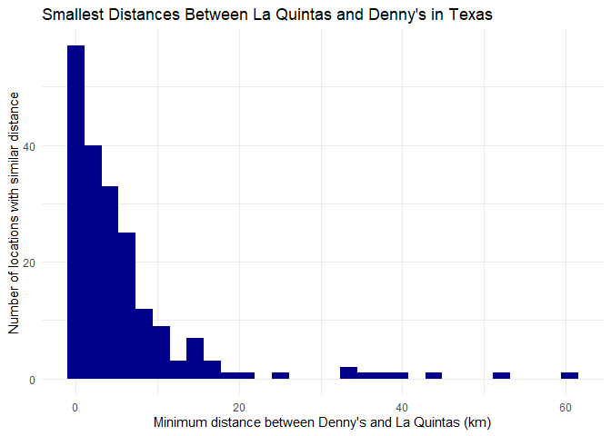
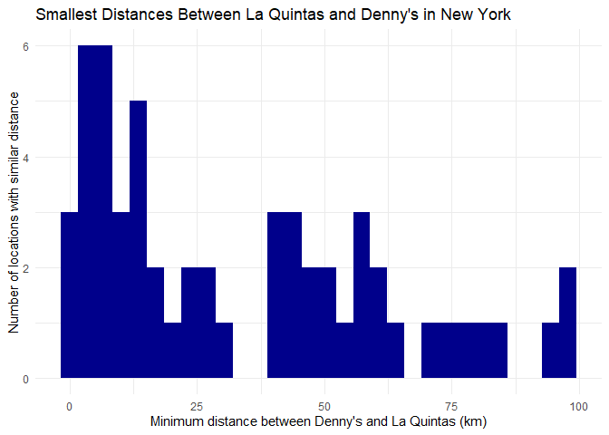

Lab 05 - La Quinta is Spanish for next to Denny’s, Pt. 2
================
Linn Zapffe
5/2/2025

### Load packages and data

``` r
library(tidyverse) 
library(dsbox) 
```

``` r
states <- read_csv("data/states.csv")
```

### Exercise 1

``` r
dennys_ak <- dennys %>%
  filter(state == "AK")
nrow(dennys_ak)
```

    ## [1] 3

There are 3 locations of Denny’s in Alaska.

``` r
laquinta_ak <- laquinta %>%
  filter(state == "AK")
nrow(laquinta_ak)
```

    ## [1] 2

There are 2 locations of La Quinta in Alaska.

### Exercise 2

``` r
comb <- nrow(laquinta_ak) * nrow(dennys_ak)
```

There are 6 combinations of Denny’s and La Quintas.

### Exercise 3

``` r
dn_lq_ak <- full_join(dennys_ak, laquinta_ak, by = "state")
```

    ## Warning in full_join(dennys_ak, laquinta_ak, by = "state"): Detected an unexpected many-to-many relationship between `x` and `y`.
    ## ℹ Row 1 of `x` matches multiple rows in `y`.
    ## ℹ Row 1 of `y` matches multiple rows in `x`.
    ## ℹ If a many-to-many relationship is expected, set `relationship =
    ##   "many-to-many"` to silence this warning.

``` r
dn_lq_ak
```

    ## # A tibble: 6 × 11
    ##   address.x     city.x state zip.x longitude.x latitude.x address.y city.y zip.y
    ##   <chr>         <chr>  <chr> <chr>       <dbl>      <dbl> <chr>     <chr>  <chr>
    ## 1 2900 Denali   Ancho… AK    99503       -150.       61.2 3501 Min… "\nAn… 99503
    ## 2 2900 Denali   Ancho… AK    99503       -150.       61.2 4920 Dal… "\nFa… 99709
    ## 3 3850 Debarr … Ancho… AK    99508       -150.       61.2 3501 Min… "\nAn… 99503
    ## 4 3850 Debarr … Ancho… AK    99508       -150.       61.2 4920 Dal… "\nFa… 99709
    ## 5 1929 Airport… Fairb… AK    99701       -148.       64.8 3501 Min… "\nAn… 99503
    ## 6 1929 Airport… Fairb… AK    99701       -148.       64.8 4920 Dal… "\nFa… 99709
    ## # ℹ 2 more variables: longitude.y <dbl>, latitude.y <dbl>

### Exercise 4

There are 6 observations in the combined data frame. The variable names
are address.x, city.x, state, zip.x, longitude.x, latitude.x, address.y,
city.y, zip.y, longitude.y, latitude.y.

### Exercise 5

The following function is copy-pasted from the haversine.R file
somewhere on the internet.

``` r
haversine <- function(long1, lat1, long2, lat2, round = 3) {
  # convert to radians
  long1 <- long1 * pi / 180
  lat1 <- lat1 * pi / 180
  long2 <- long2 * pi / 180
  lat2 <- lat2 * pi / 180

  R <- 6371 # Earth mean radius in km

  a <- sin((lat2 - lat1) / 2)^2 + cos(lat1) * cos(lat2) * sin((long2 - long1) / 2)^2
  d <- R * 2 * asin(sqrt(a))

  return(round(d, round)) # distance in km
}
```

### Exercise 6

Calculate the distance between the locations:

``` r
dn_lq_ak <- dn_lq_ak %>%
  mutate(distance = haversine(longitude.x, latitude.x, longitude.y, latitude.y))
```

### Exercise 7

``` r
dn_lq_ak_mindist <- dn_lq_ak %>%
  group_by(address.x) %>%
  summarize(closest = min(distance))
```

### Exercise 8

``` r
dn_lq_ak_mindist %>%
  ggplot(aes(x = address.x, y = closest, fill = address.x)) +
  # Had to include stat = "identity" so that it doesn't try to calculate counts, since we only have one data point per address
  geom_bar(stat = "identity") +
  labs(
    title = "Smallest Distances Between La Quintas and Denny's in Alaska",
    x = "Address of Denny's",
    y = "Distance to closest La Quinta (km)"
  ) +
  scale_fill_brewer(palette = "Set1", guide = "none") +
  theme_minimal()
```

<!-- -->

The distances seem to be not too long, the average distance is 4.41km,
meaning that it would take on average maybe 5 minutes to drive between
the La Quintas and Denny’s. However, it is not walking distance.

### Exercise 9

Doing this all again, but for North Carolina instead of Alaska:

``` r
dennys_nc <- dennys %>%
  filter(state == "NC")
nrow(dennys_nc)
```

    ## [1] 28

``` r
laquinta_nc <- laquinta %>%
  filter(state == "NC")
nrow(laquinta_nc)
```

    ## [1] 12

``` r
dn_lq_nc <- full_join(dennys_nc, laquinta_nc, by = "state")
```

    ## Warning in full_join(dennys_nc, laquinta_nc, by = "state"): Detected an unexpected many-to-many relationship between `x` and `y`.
    ## ℹ Row 1 of `x` matches multiple rows in `y`.
    ## ℹ Row 1 of `y` matches multiple rows in `x`.
    ## ℹ If a many-to-many relationship is expected, set `relationship =
    ##   "many-to-many"` to silence this warning.

``` r
dn_lq_nc
```

    ## # A tibble: 336 × 11
    ##    address.x    city.x state zip.x longitude.x latitude.x address.y city.y zip.y
    ##    <chr>        <chr>  <chr> <chr>       <dbl>      <dbl> <chr>     <chr>  <chr>
    ##  1 1 Regent Pa… Ashev… NC    28806       -82.6       35.6 165 Hwy … "\nBo… 28607
    ##  2 1 Regent Pa… Ashev… NC    28806       -82.6       35.6 3127 Slo… "\nCh… 28208
    ##  3 1 Regent Pa… Ashev… NC    28806       -82.6       35.6 4900 Sou… "\nCh… 28217
    ##  4 1 Regent Pa… Ashev… NC    28806       -82.6       35.6 4414 Dur… "\nDu… 27707
    ##  5 1 Regent Pa… Ashev… NC    28806       -82.6       35.6 1910 Wes… "\nDu… 27713
    ##  6 1 Regent Pa… Ashev… NC    28806       -82.6       35.6 1201 Lan… "\nGr… 27407
    ##  7 1 Regent Pa… Ashev… NC    28806       -82.6       35.6 1607 Fai… "\nCo… 28613
    ##  8 1 Regent Pa… Ashev… NC    28806       -82.6       35.6 191 Cres… "\nCa… 27518
    ##  9 1 Regent Pa… Ashev… NC    28806       -82.6       35.6 2211 Sum… "\nRa… 27612
    ## 10 1 Regent Pa… Ashev… NC    28806       -82.6       35.6 1001 Aer… "\nMo… 27560
    ## # ℹ 326 more rows
    ## # ℹ 2 more variables: longitude.y <dbl>, latitude.y <dbl>

``` r
dn_lq_nc <- dn_lq_nc %>%
  mutate(distance = haversine(longitude.x, latitude.x, longitude.y, latitude.y))

dn_lq_nc_mindist <- dn_lq_nc %>%
  group_by(address.x) %>%
  summarize(closest = min(distance))
```

``` r
dn_lq_nc_mindist %>%
  ggplot(aes(x = closest)) +
  geom_histogram(fill = "darkblue") +
  labs(
   title = "Smallest Distances Between La Quintas and Denny's in North Carolina",
   x = "Minimum distance between Denny's and La Quintas (km)",
   y = "Number of locations with similar distance") +
  theme_minimal()
```

    ## `stat_bin()` using `bins = 30`. Pick better value with `binwidth`.

<!-- -->

The distances are a lot bigger between the two chains in North Carolina
than Alaska. The average distance is 65.4443214 km away from each other,
which is a solid drive, maybe closer to 1-2 hours from each other.

### Exercise 10

Doing this all again, but this time, for Texas:

``` r
dennys_tx <- dennys %>%
  filter(state == "TX")
nrow(dennys_tx)
```

    ## [1] 200

``` r
laquinta_tx <- laquinta %>%
  filter(state == "TX")
nrow(laquinta_tx)
```

    ## [1] 237

``` r
dn_lq_tx <- full_join(dennys_tx, laquinta_tx, by = "state")
```

    ## Warning in full_join(dennys_tx, laquinta_tx, by = "state"): Detected an unexpected many-to-many relationship between `x` and `y`.
    ## ℹ Row 1 of `x` matches multiple rows in `y`.
    ## ℹ Row 1 of `y` matches multiple rows in `x`.
    ## ℹ If a many-to-many relationship is expected, set `relationship =
    ##   "many-to-many"` to silence this warning.

``` r
dn_lq_tx
```

    ## # A tibble: 47,400 × 11
    ##    address.x    city.x state zip.x longitude.x latitude.x address.y city.y zip.y
    ##    <chr>        <chr>  <chr> <chr>       <dbl>      <dbl> <chr>     <chr>  <chr>
    ##  1 120 East I-… Abile… TX    79601       -99.6       32.4 3018 Cat… "\nAb… 79606
    ##  2 120 East I-… Abile… TX    79601       -99.6       32.4 3501 Wes… "\nAb… 79601
    ##  3 120 East I-… Abile… TX    79601       -99.6       32.4 14925 La… "\nAd… 75254
    ##  4 120 East I-… Abile… TX    79601       -99.6       32.4 909 East… "\nAl… 78516
    ##  5 120 East I-… Abile… TX    79601       -99.6       32.4 2400 Eas… "\nAl… 78332
    ##  6 120 East I-… Abile… TX    79601       -99.6       32.4 1220 Nor… "\nAl… 75013
    ##  7 120 East I-… Abile… TX    79601       -99.6       32.4 1165 Hwy… "\nAl… 76009
    ##  8 120 East I-… Abile… TX    79601       -99.6       32.4 880 Sout… "\nAl… 77511
    ##  9 120 East I-… Abile… TX    79601       -99.6       32.4 1708 Int… "\nAm… 79103
    ## 10 120 East I-… Abile… TX    79601       -99.6       32.4 9305 Eas… "\nAm… 79118
    ## # ℹ 47,390 more rows
    ## # ℹ 2 more variables: longitude.y <dbl>, latitude.y <dbl>

``` r
dn_lq_tx <- dn_lq_tx %>%
  mutate(distance = haversine(longitude.x, latitude.x, longitude.y, latitude.y))

dn_lq_tx_mindist <- dn_lq_tx %>%
  group_by(address.x) %>%
  summarize(closest = min(distance))
```

``` r
dn_lq_tx_mindist %>%
  ggplot(aes(x = closest)) +
  geom_histogram(fill = "darkblue") +
  labs(
   title = "Smallest Distances Between La Quintas and Denny's in Texas",
   x = "Minimum distance between Denny's and La Quintas (km)",
   y = "Number of locations with similar distance") +
  theme_minimal()
```

    ## `stat_bin()` using `bins = 30`. Pick better value with `binwidth`.

<!-- -->

The distances in Texas are a lot smaller again than what it was in North
Carolina. There is a little big of range, so there are some locations
where the chains are further apart. However, the mean is 5.7918 km away
from each other, which is similar to the average in Alaska, with about a
5 minute drive.

### Exercise 11

Doing this all again, this time for New York, where I went for
undergrad:

``` r
dennys_ny <- dennys %>%
  filter(state == "NY")
nrow(dennys_ny)
```

    ## [1] 56

``` r
laquinta_ny <- laquinta %>%
  filter(state == "NY")
nrow(laquinta_ny)
```

    ## [1] 19

``` r
dn_lq_ny <- full_join(dennys_ny, laquinta_ny, by = "state")
```

    ## Warning in full_join(dennys_ny, laquinta_ny, by = "state"): Detected an unexpected many-to-many relationship between `x` and `y`.
    ## ℹ Row 1 of `x` matches multiple rows in `y`.
    ## ℹ Row 1 of `y` matches multiple rows in `x`.
    ## ℹ If a many-to-many relationship is expected, set `relationship =
    ##   "many-to-many"` to silence this warning.

``` r
dn_lq_ny
```

    ## # A tibble: 1,064 × 11
    ##    address.x    city.x state zip.x longitude.x latitude.x address.y city.y zip.y
    ##    <chr>        <chr>  <chr> <chr>       <dbl>      <dbl> <chr>     <chr>  <chr>
    ##  1 114 Wolf Ro… Albany NY    12205       -73.8       42.7 94 Busin… "\nAr… 10504
    ##  2 114 Wolf Ro… Albany NY    12205       -73.8       42.7 8200 Par… "\nBa… 14020
    ##  3 114 Wolf Ro… Albany NY    12205       -73.8       42.7 581 Harr… "\nJo… 13790
    ##  4 114 Wolf Ro… Albany NY    12205       -73.8       42.7 1229 Atl… "\nBr… 11216
    ##  5 114 Wolf Ro… Albany NY    12205       -73.8       42.7 533 3rd … "\nBr… 11215
    ##  6 114 Wolf Ro… Albany NY    12205       -73.8       42.7 1412 Pit… "\nBr… 11233
    ##  7 114 Wolf Ro… Albany NY    12205       -73.8       42.7 6619 Tra… "\nWi… 14221
    ##  8 114 Wolf Ro… Albany NY    12205       -73.8       42.7 1749 Rou… "\nCl… 12065
    ##  9 114 Wolf Ro… Albany NY    12205       -73.8       42.7 540 Saw … "\nEl… 10523
    ## 10 114 Wolf Ro… Albany NY    12205       -73.8       42.7 4317 Roc… "\nFa… 11692
    ## # ℹ 1,054 more rows
    ## # ℹ 2 more variables: longitude.y <dbl>, latitude.y <dbl>

``` r
dn_lq_ny <- dn_lq_ny %>%
  mutate(distance = haversine(longitude.x, latitude.x, longitude.y, latitude.y))

dn_lq_ny_mindist <- dn_lq_ny %>%
  group_by(address.x) %>%
  summarize(closest = min(distance))
```

``` r
dn_lq_ny_mindist %>%
  ggplot(aes(x = closest)) +
  geom_histogram(fill = "darkblue") +
  labs(
   title = "Smallest Distances Between La Quintas and Denny's in Texas",
   x = "Minimum distance between Denny's and La Quintas (km)",
   y = "Number of locations with similar distance") +
  theme_minimal()
```

    ## `stat_bin()` using `bins = 30`. Pick better value with `binwidth`.

<!-- -->

The distances in New York are more spread out than in Texas, but less so
than in North Carolina. There are some that are very close to each
other, some that are about an 1 hour away, and some that are even
further away. The average is 33.5745 km, which is about half an hour of
a drive.

### Exercise 12

Based on these analyses, it seems like whether Mitch Hedberg’s joke is
accurate depends on what state you are in. For some states, like Alaska
and Texas, it seems pretty accurate, but for others, like North
Carolina, it seems to not be very accurate.
