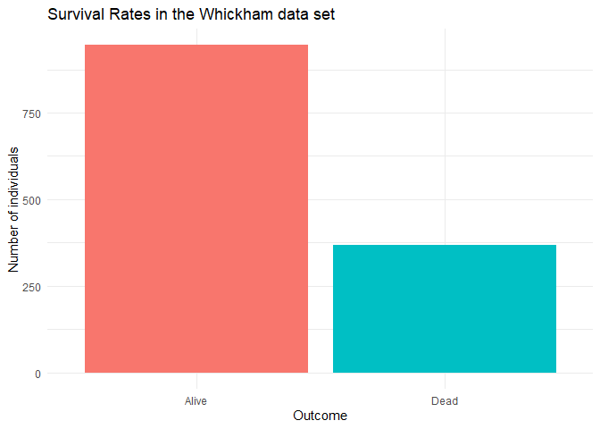
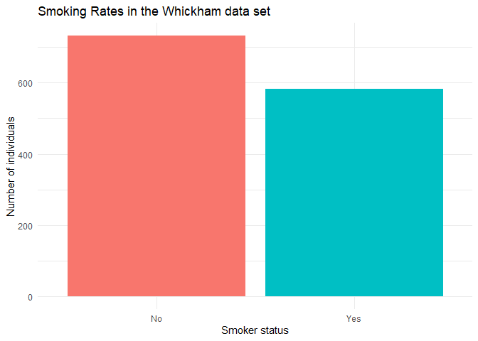
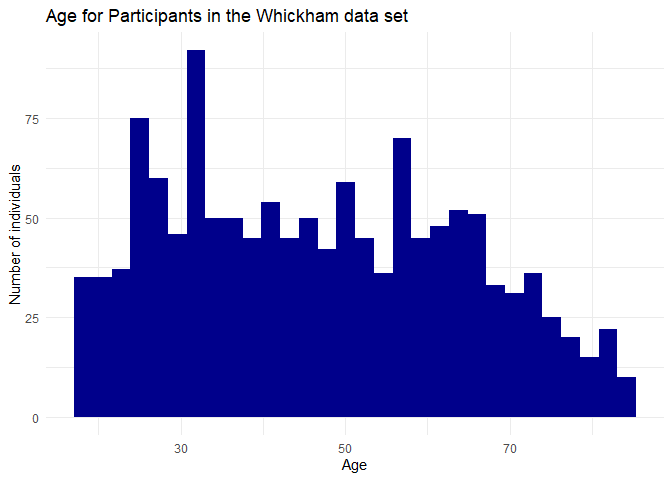
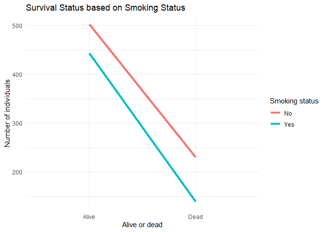
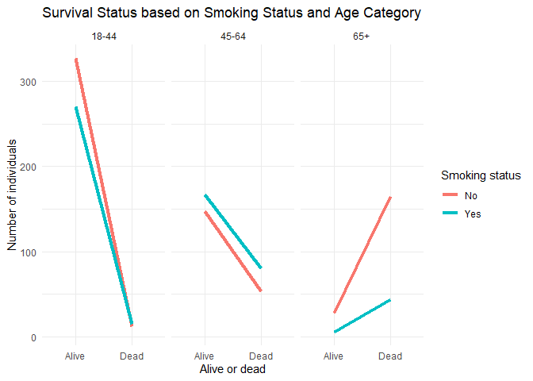

Lab 06 - Ugly charts and Simpson’s paradox
================
Linn Zapffe
5/2/2025

### Load packages and data

``` r
library(tidyverse) 
library(dsbox)
library(mosaicData)
```

    ## Warning: package 'mosaicData' was built under R version 4.3.3

``` r
# To highlight certain lines in a graph
library(ggrepel)
```

    ## Warning: package 'ggrepel' was built under R version 4.3.3

## Instructional staff employment trends

### Exercise 1

``` r
staff <- read_csv("data/instructional-staff.csv")
```

    ## Rows: 5 Columns: 12
    ## ── Column specification ────────────────────────────────────────────────────────
    ## Delimiter: ","
    ## chr  (1): faculty_type
    ## dbl (11): 1975, 1989, 1993, 1995, 1999, 2001, 2003, 2005, 2007, 2009, 2011
    ## 
    ## ℹ Use `spec()` to retrieve the full column specification for this data.
    ## ℹ Specify the column types or set `show_col_types = FALSE` to quiet this message.

``` r
staff_long <- staff %>%
  pivot_longer(cols = -faculty_type, names_to = "year") %>%
  mutate(value = as.numeric(value))

staff_long
```

    ## # A tibble: 55 × 3
    ##    faculty_type              year  value
    ##    <chr>                     <chr> <dbl>
    ##  1 Full-Time Tenured Faculty 1975   29  
    ##  2 Full-Time Tenured Faculty 1989   27.6
    ##  3 Full-Time Tenured Faculty 1993   25  
    ##  4 Full-Time Tenured Faculty 1995   24.8
    ##  5 Full-Time Tenured Faculty 1999   21.8
    ##  6 Full-Time Tenured Faculty 2001   20.3
    ##  7 Full-Time Tenured Faculty 2003   19.3
    ##  8 Full-Time Tenured Faculty 2005   17.8
    ##  9 Full-Time Tenured Faculty 2007   17.2
    ## 10 Full-Time Tenured Faculty 2009   16.8
    ## # ℹ 45 more rows

Line graph of the data set:

``` r
staff_long %>%
  ggplot(aes(
    x = year,
    y = value,
    group = faculty_type,
    color = faculty_type
  )) +
  geom_line()
```

<!-- -->

### Exercise 2

Improving the above plot:

I tried first doing this without additional libraries. After getting
labels that overlapped, I gave up and used the library ggrepel. That
seems easier than to start adjusting labels individually.

``` r
staff_long %>%
  mutate(
    color_crit = case_when(
      faculty_type == "Part-Time Faculty" ~ "red",
      faculty_type %in% c("Full-Time Tenured Faculty", "Full-Time Tenure-Track Faculty", "Full-Time Non-Tenure-Track Faculty") ~ "darkblue",
      faculty_type == "Graduate Student Employees" ~ "grey"
    )
  ) %>%
  ggplot(aes(
    x = year,
    y = value,
    group = faculty_type,
    color = color_crit
  )) +
  geom_line(linewidth = 1) +
  scale_color_identity() +
  theme_minimal() +
  labs(
    title = "Percentage of Hires per Faculty Type over Time",
    x = "Year",
    y = "Proportion of hires",
    color = "Faculty type"
  ) +
  geom_label_repel(aes(label = if_else(year == 2003, faculty_type, "")))
```

<!-- -->

I am trying to highlight that there are more part-time faculty, and
fewer full-time faculty. Therefore, I chose to color the part-time
faculty as being red, to draw the viewer’s attention there. I colored
all the full-time positions as blue, because the distinction doesn’t
matter that much in this case and left graduate student employees grey
as that is not as important. I could also have collapsed the data for
all full-time faculty and removed that for part-time faculty.

### Exercise 3

Here are some thoughts about how to improve the Fisheries plot:

- Not using 3D for the plots, because it is distracting and harder to
  interpret (area vs surface)
- Not use pie charts, but instead bar charts, because we are better at
  interpreting surface than area
- Maybe change the scale of the y-axis of the filled-line plot, since I
  can’t see anything for most of the countries, since China is an
  extreme outlier. Alternatively, zoom in on the data with smaller
  values in China isn’t that important.
- Remove the background color for the pie charts, makes it harder to see
  contrast
- Add a legend to the filled-line graph. I don’t know what the two
  colors mean
- Add titles to the graphs
- Add a caption with the source of the data
- Remove shading from the pie chart, as that is only distracting
- Maybe add some texture in addition to the colors to make it more
  accessible and easier to read in grey scale printing. Alternatively,
  make colors that contrast more or add labels where the data is instead
  of having a legend.
- It is a little hard to know exactly what the graphs show, since it
  isn’t explained well. However, it seems like the filled-line graph and
  pie chart is showing the same information, which seems unnecessary. I
  might make both, but I would think only one of them would be needed.
- I would also test out flipping the axes for the filled-line graph,
  since it is a little hard to read the country names when they are
  tilted.
- Not have more colored area that countries. The pie charts have 6
  countries, but maybe 30 different sections. Are the country data
  divided into several categories? In that case, it should be collapsed
  into just one data point per country.

``` r
fisheries <- read_csv("data/fisheries.csv")
```

    ## Rows: 216 Columns: 4
    ## ── Column specification ────────────────────────────────────────────────────────
    ## Delimiter: ","
    ## chr (1): country
    ## dbl (3): capture, aquaculture, total
    ## 
    ## ℹ Use `spec()` to retrieve the full column specification for this data.
    ## ℹ Specify the column types or set `show_col_types = FALSE` to quiet this message.

Looking at the data, there are way to many countries to graph.
Therefore, I will try seeing what the top countries are based on total
fishery production:

``` r
fisheries %>%
  arrange(desc(total))
```

    ## # A tibble: 216 × 4
    ##    country        capture aquaculture    total
    ##    <chr>            <dbl>       <dbl>    <dbl>
    ##  1 China         17800000    63700000 81500000
    ##  2 Indonesia      6584419    16600000 23184419
    ##  3 India          5082332     5703002 10785334
    ##  4 Vietnam        2785940     3634531  6420471
    ##  5 United States  4931017      444369  5375386
    ##  6 Russia         4773413      173840  4947253
    ##  7 Japan          3275263     1067994  4343257
    ##  8 Philippines    2027992     2200914  4228906
    ##  9 Peru           3811802      100187  3911989
    ## 10 Bangladesh     1674770     2203554  3878324
    ## # ℹ 206 more rows

I think top 10 countries might be good. There might be political reasons
to include other specific countries, but I don’t have any of those, so I
will stick with top 10.

``` r
fisheries_top_10 <- fisheries %>%
  slice_max(order_by = total, n = 10)
fisheries_top_10
```

    ## # A tibble: 10 × 4
    ##    country        capture aquaculture    total
    ##    <chr>            <dbl>       <dbl>    <dbl>
    ##  1 China         17800000    63700000 81500000
    ##  2 Indonesia      6584419    16600000 23184419
    ##  3 India          5082332     5703002 10785334
    ##  4 Vietnam        2785940     3634531  6420471
    ##  5 United States  4931017      444369  5375386
    ##  6 Russia         4773413      173840  4947253
    ##  7 Japan          3275263     1067994  4343257
    ##  8 Philippines    2027992     2200914  4228906
    ##  9 Peru           3811802      100187  3911989
    ## 10 Bangladesh     1674770     2203554  3878324

Making a bar graph:

``` r
fisheries_top_10 %>%
  mutate(total = total / 100000) %>%
  ggplot(aes(x = reorder(country, -total), y = total, fill = country)) +
  geom_bar(stat = "identity") +
  coord_flip() +
  labs(
    total = "Total Fish Harvest by Top 10 Countries",
    x = "Countries",
    y = "Total Harvest (in 100 000s)"
  ) +
  guides(fill = "none") +
  theme_minimal()
```

<!-- -->

It could also be interesting to see the distribution of fish captures
and harvested for each country in the bar graph. I will make that
version of the plot too.

``` r
# Make a new data set that is long instead of wide to make the capture and aquaculture variables one variable that can be stacked by
fisheries_top_10_long <- fisheries_top_10 %>%
  pivot_longer(cols = c(capture, aquaculture), names_to = "type", values_to = "tons_fish")

# Creating the stacked bar plot
fisheries_top_10_long %>%
  # Mutating to make the variable in 100 000s, so that the scale is more readable
  mutate(tons_fish = tons_fish / 100000) %>%
  ggplot(aes(x = reorder(country, -total), y = tons_fish, fill = type)) +
  geom_bar(stat = "identity", position = "stack") +
  coord_flip() +
  labs(
    total = "Total Fish Harvest by Top 10 Countries",
    x = "Countries",
    y = "Total Harvest (in 100 000s)"
  ) +
  theme_minimal()
```

<!-- -->

### Exercise 4

``` r
data(Whickham)
```

#### Question 1

I think the data comes from an observational study, because they are
looking at smoking and survival rate. It would hard to design an ethical
study where some people will smoke regularly and others won’t, so it is
most like observational.

#### Question 2

There are 1314 observations in the data set. Each observation is a
participant in the study.

#### Question 3

There are 3 variables in the data set. These are outcome, smoker, age.
The object type of the columns are: `rsapply(Whickham, class)`.

``` r
Whickham %>%
  ggplot(aes(x = outcome, fill = outcome)) +
  geom_bar() +
  labs(
    title = "Survival Rates in the Whickham data set",
    x = "Outcome",
    y = "Number of individuals"
  ) +
  guides(fill = "none") +
  theme_minimal()
```

<!-- -->

``` r
Whickham %>%
  ggplot(aes(x = smoker, fill = smoker)) +
  geom_bar() +
  labs(
    title = "Skoming Rates in the Whickham data set",
    x = "Smoker status",
    y = "Number of individuals"
  ) +
  guides(fill = "none") +
  theme_minimal()
```

<!-- -->

``` r
Whickham %>%
  ggplot(aes(x = age)) +
  geom_histogram(fill = "darkblue") +
  labs(
    title = "Age for Participants in the Whickham data set",
    x = "Age",
    y = "Number of individuals"
  ) +
  theme_minimal()
```

    ## `stat_bin()` using `bins = 30`. Pick better value with `binwidth`.

<!-- -->

#### Question 4

I would expect there to be a relationship between smoking and health
outcome, so that smokers are more likely to not be alive at the time of
data collection than non-smokers.

#### Question 5

``` r
Whickham %>%
  count(smoker, outcome) %>%
  ggplot(aes(x = outcome, y = n, group = smoker, color = smoker)) +
  geom_line(linewidth = 1.5) +
  labs(
    title = "Survival Status based on Smoking Status",
    x = "Alive or dead",
    y = "Number of individuals"
  ) +
  theme_minimal()
```

<!-- -->

There doesn’t really seem to be any relationship between smoking and
survival outcome as the lines are more or less parallel. This is not
what I was expecting.

``` r
Whickham %>%
  count(smoker, outcome) %>%
  group_by(smoker) %>%
  mutate(cond_prob = n /sum(n))
```

    ## # A tibble: 4 × 4
    ## # Groups:   smoker [2]
    ##   smoker outcome     n cond_prob
    ##   <fct>  <fct>   <int>     <dbl>
    ## 1 No     Alive     502     0.686
    ## 2 No     Dead      230     0.314
    ## 3 Yes    Alive     443     0.761
    ## 4 Yes    Dead      139     0.239

``` r
# Got some help from ChatGPT to figure out how to use the group_by and mutate to make the new variable without making a function. I apparently don't understand group_by as well as I could.
```

The probabilities of being alive or dead are also fairly similar based
on smoking status. It is even slightly more likely for participants that
were smokers to be alive, than for non-smokers.

### Question 6

Creating a new variable for binned ages:

``` r
Whickham_df <- Whickham %>%
  mutate(age_cat = case_when(
    age <= 44 ~ "18-44",
    age > 44 & age <= 64 ~ "45-64",
    age > 64 ~ "65+"
  ))
```

### Question 7

Recreating the previous plot faceted by age category:

``` r
Whickham_df %>%
  count(smoker, age_cat, outcome) %>%
  ggplot(aes(x = outcome, y = n, group = smoker, color = smoker)) +
  geom_line(linewidth = 1.5) +
  facet_wrap(vars(age_cat)) +
  labs(
    title = "Survival Status based on Smoking Status and Age Category",
    x = "Alive or dead",
    y = "Number of individuals"
  ) +
  theme_minimal()
```

<!-- -->

Now, you can see that smoking makes it more likely that you will not
survive in the young age category, from 18-44. At 45-64 years old,
smoking status doesn’t really matter. While at 65+, smoking makes it
more likely that you will be alive compared to being a non-smoker.

Calculating conditional probabilities:

``` r
Whickham_df %>%
  count(smoker, age_cat, outcome) %>%
  group_by(smoker, age_cat) %>%
  mutate(cond_prob = n /sum(n))
```

    ## # A tibble: 12 × 5
    ## # Groups:   smoker, age_cat [6]
    ##    smoker age_cat outcome     n cond_prob
    ##    <fct>  <chr>   <fct>   <int>     <dbl>
    ##  1 No     18-44   Alive     327    0.965 
    ##  2 No     18-44   Dead       12    0.0354
    ##  3 No     45-64   Alive     147    0.735 
    ##  4 No     45-64   Dead       53    0.265 
    ##  5 No     65+     Alive      28    0.145 
    ##  6 No     65+     Dead      165    0.855 
    ##  7 Yes    18-44   Alive     270    0.947 
    ##  8 Yes    18-44   Dead       15    0.0526
    ##  9 Yes    45-64   Alive     167    0.676 
    ## 10 Yes    45-64   Dead       80    0.324 
    ## 11 Yes    65+     Alive       6    0.12  
    ## 12 Yes    65+     Dead       44    0.88

Looking at this data, I would want to look further into the sample sizes
per category. There are for example very few participants that are still
alive in the smoking category, which could influence the results. In
addition, I would also think that there are other factors (confounds)
that could influence the relationships we see here. It might be that
people who are older (65+) and have bad health, stop smoking, so that it
looks like not smoking makes you more likely to die, when in reality, it
might just be that people in bad health stop smoking to try to improve
their health (and at the same time tend to die earlier because of their
bad health). In this case, there might be a correlation, but not
causation, between smoking and survival outcome, since there is a third
variable, health, that effects both of our variables, making it look
like they affect each other.
