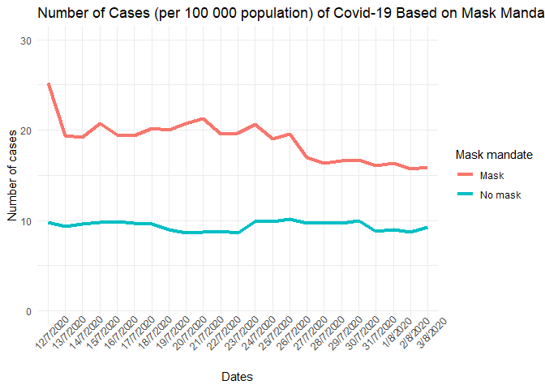

Lab 07 - Conveying the right message through visualisation
================
Linn Zapffe
14/2/2025

### Load packages and data

``` r
library(tidyverse) 
```

### Exercise 1

Making a tibble with made-up data to play around with for
visualizations:

``` r
df <- tribble(
  ~mask, ~cases, ~date,
  "mask", 25.2, "12/7/2020",
  "mask", 19.4, "13/7/2020",
  "mask", 19.2, "14/7/2020",
  "mask", 20.7, "15/7/2020",
  "mask", 19.5, "16/7/2020",
  "mask", 19.4, "17/7/2020",
  "mask", 20.2, "18/7/2020",
  "mask", 20.0, "19/7/2020",
  "mask", 20.7, "20/7/2020",
  "mask", 21.3, "21/7/2020",
  "mask", 19.6, "22/7/2020",
  "mask", 19.7, "23/7/2020",
  "mask", 20.6, "24/7/2020",
  "mask", 19.0, "25/7/2020",
  "mask", 19.6, "26/7/2020",
  "mask", 17.0, "27/7/2020",
  "mask", 16.3, "28/7/2020",
  "mask", 16.6, "29/7/2020",
  "mask", 16.7, "30/7/2020",
  "mask", 16.1, "31/7/2020",
  "mask", 16.3, "1/8/2020",
  "mask", 15.7, "2/8/2020",
  "mask", 15.9, "3/8/2020",
  "no mask", 9.8, "12/7/2020",
  "no mask", 9.3, "13/7/2020",
  "no mask", 9.6, "14/7/2020",
  "no mask", 9.8, "15/7/2020",
  "no mask", 9.9, "16/7/2020",
  "no mask", 9.7, "17/7/2020",
  "no mask", 9.6, "18/7/2020",
  "no mask", 9.0, "19/7/2020",
  "no mask", 8.6, "20/7/2020",
  "no mask", 8.7, "21/7/2020",
  "no mask", 8.8, "22/7/2020",
  "no mask", 8.6, "23/7/2020",
  "no mask", 9.9, "24/7/2020",
  "no mask", 9.9, "25/7/2020",
  "no mask", 10.1, "26/7/2020",
  "no mask", 9.7, "27/7/2020",
  "no mask", 9.7, "28/7/2020",
  "no mask", 9.7, "29/7/2020",
  "no mask", 10.0, "30/7/2020",
  "no mask", 8.8, "31/7/2020",
  "no mask", 9.0, "1/8/2020",
  "no mask", 8.7, "2/8/2020",
  "no mask", 9.2, "3/8/2020"
)
```

### Exercise 2

Creating a more appropriate visualization:

``` r
df %>%
  ggplot(aes(x = date, y = cases, group = mask, color = mask, group = 1)) +
  geom_line(linewidth = 1.5) +
  theme_minimal() +
  labs(
    title = "Number of Cases (per 100 000 population) of Covid-19 Based on Mask Mandates",
    x = "Dates",
    y = "Number of cases",
    color = "Mask mandate"
  ) +
  theme(axis.text.x = element_text(angle = 45))
```

    ## Warning: Duplicated aesthetics after name standardisation: group

<!-- -->

## Exercise 3

There are a lot more cases of Covid in counties with a mask mandate than
without. The last visualization had two different scales for the two
groups, making it seem like there was more cases in counties with masks
initially, but that it dropped down to levels lower than in counties
with no mask mandate after a week or so. That wasn’t the case. As you
can see in this visualization, there are a lot fewer cases in counties
with no mask mandate.

## Exercise 4

From the graph, it seems like wearing a mask leads to more covid cases,
which seems a little weird, but there are some ways it could make sense.
For example, maybe these counties have more open rules around social
gatherings that the no mask counties, since they think masks will delay
the spread.

## Exericse 5
