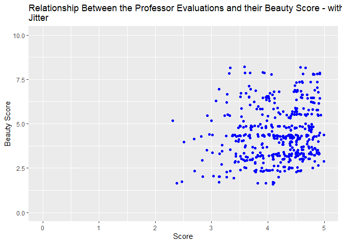
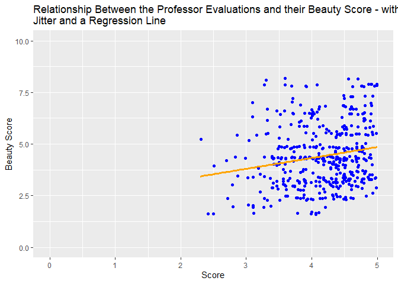

Lab 09 - Grading the professor, Pt. 1
================
Insert your name here
Insert date here

### Load packages and data

``` r
library(tidyverse) 
```

    ## Warning: package 'ggplot2' was built under R version 4.3.3

    ## Warning: package 'tidyr' was built under R version 4.3.3

    ## Warning: package 'readr' was built under R version 4.3.3

    ## Warning: package 'purrr' was built under R version 4.3.3

    ## Warning: package 'lubridate' was built under R version 4.3.3

``` r
library(tidymodels)
```

    ## Warning: package 'tidymodels' was built under R version 4.3.3

    ## Warning: package 'broom' was built under R version 4.3.3

    ## Warning: package 'dials' was built under R version 4.3.3

    ## Warning: package 'infer' was built under R version 4.3.3

    ## Warning: package 'modeldata' was built under R version 4.3.3

    ## Warning: package 'parsnip' was built under R version 4.3.3

    ## Warning: package 'recipes' was built under R version 4.3.3

    ## Warning: package 'rsample' was built under R version 4.3.3

    ## Warning: package 'tune' was built under R version 4.3.3

    ## Warning: package 'workflows' was built under R version 4.3.3

    ## Warning: package 'workflowsets' was built under R version 4.3.3

    ## Warning: package 'yardstick' was built under R version 4.3.3

``` r
library(openintro)
```

    ## Warning: package 'openintro' was built under R version 4.3.3

    ## Warning: package 'airports' was built under R version 4.3.3

    ## Warning: package 'cherryblossom' was built under R version 4.3.3

    ## Warning: package 'usdata' was built under R version 4.3.3

### Exercise 1

Plotting the distribution of the professor ratings:

``` r
evals %>% 
  ggplot(aes(x = score)) +
  geom_histogram(fill = "blue") +
  labs(
    title = "Distribution of Scores for Professor Evaluations",
    x = "Score",
    y = "Frequency"
  ) +
  xlim(0, 5)
```

    ## `stat_bin()` using `bins = 30`. Pick better value with `binwidth`.

    ## Warning: Removed 2 rows containing missing values or values outside the scale range
    ## (`geom_bar()`).

<!-- -->

The distribution is negatively skewed. That means that most students
rate their professors positively. I didn’t expect it to be that high,
but it makes sense that it is not equally distributed across all scores,
as the university hopefully hire professors that are relatively good at
their job. In addition, if they do like WF and have students give
feedback on paper in a small class, so that it would be very easy for
professors to identify what score is from whom, students might feel
pressured to give higher ratings to not damage their relationship with
the professor.

### Exercise 2

Plotting the relationship between professor ratings and their beauty
score:

``` r
evals %>% 
  ggplot(aes(x = score, y = bty_avg)) +
  geom_point( color = "blue") +
  labs(
    title = "Relationship Between the Professor Evaluations and their Beauty Score",
    x = "Score",
    y = "Beauty Score"
  ) +
  xlim(0, 5) +
  ylim(0, 10)
```

<!-- -->

### Exercise 3

Plotting the relationship between professor ratings and their beauty
score, with jitter:

``` r
evals %>% 
  ggplot(aes(x = score, y = bty_avg)) +
  geom_jitter(color = "blue") +
  labs(
    title = "Relationship Between the Professor Evaluations and their Beauty Score - with Jitter",
    x = "Score",
    y = "Beauty Score"
  ) +
  xlim(0, 5) + 
  ylim(0, 10)
```

    ## Warning: Removed 3 rows containing missing values or values outside the scale range
    ## (`geom_point()`).

<!-- -->

Figured out that using both geom_point and geom_jitter doesn’t work very
well, because it essentially duplicates all the data and shows twice as
many data points as are actually in the data set.

Jitter adds a little bit of random noise to our data set, so that data
points with the same value will be slightly different. This is
beneficial for plotting because it won’t show the data points as being
on top of each other (looking like there is only one), but will instead
make them clustered around the original value, showing the number of
data points around that value accurately. With jitter, you can now see
that there are a lot of data points around the beauty scores of 2.5 \< x
\< 5, which wasn’t clear in the graph without jittering.

### Exercise 4

Fitting a linear model between professor rating and beauty score:

``` r
model <- lm(score ~ bty_avg, data = evals)
model
```

    ## 
    ## Call:
    ## lm(formula = score ~ bty_avg, data = evals)
    ## 
    ## Coefficients:
    ## (Intercept)      bty_avg  
    ##     3.88034      0.06664

y = 3.88 + 0.067x, where x is professor ratings and y is the beauty
score

### Exercise 5

Plotting the relationship between professor ratings and their beauty
score, with jitter and a regression line:

``` r
evals %>% 
  ggplot(aes(x = score, y = bty_avg)) +
  geom_jitter(color = "blue") +
  geom_smooth(method = "lm", se = FALSE, linewidth = 1.25, color = "orange") +
  labs(
    title = "Relationship Between the Professor Evaluations and their Beauty Score - with Jitter and a Regression Line",
    x = "Score",
    y = "Beauty Score"
  ) +
  xlim(0, 5) + 
  ylim(0, 10)
```

    ## `geom_smooth()` using formula = 'y ~ x'

    ## Warning: Removed 6 rows containing missing values or values outside the scale range
    ## (`geom_point()`).

<!-- -->

### Exercise 6

The professor ratings (from 0 to 5) will increase by 0.067 points per
beauty point (0-10): Professor ratings therefore seem to be affected by
beauty points, but it is far from the only facotr affecting them. You
can for example not get more of a boost than 0.67 points in the score
from beauty points.

### Exercise 7

The intercept of the model is 3.88, meaning that a professor with a
beauty rating of 0 will likely get a professor rating of 3.88.

### Exercise 8

Getting the R^2 of our model:

``` r
summary(model)
```

    ## 
    ## Call:
    ## lm(formula = score ~ bty_avg, data = evals)
    ## 
    ## Residuals:
    ##     Min      1Q  Median      3Q     Max 
    ## -1.9246 -0.3690  0.1420  0.3977  0.9309 
    ## 
    ## Coefficients:
    ##             Estimate Std. Error t value Pr(>|t|)    
    ## (Intercept)  3.88034    0.07614   50.96  < 2e-16 ***
    ## bty_avg      0.06664    0.01629    4.09 5.08e-05 ***
    ## ---
    ## Signif. codes:  0 '***' 0.001 '**' 0.01 '*' 0.05 '.' 0.1 ' ' 1
    ## 
    ## Residual standard error: 0.5348 on 461 degrees of freedom
    ## Multiple R-squared:  0.03502,    Adjusted R-squared:  0.03293 
    ## F-statistic: 16.73 on 1 and 461 DF,  p-value: 5.083e-05

The R^2 of the model is 0.035, with an adjusted R^2 of 0.033. That means
that beauty scores explain 3.5% of the variance in professor ratings,
which is not a lot.

### Exercise 9

Fitting a linear model between professor rating and the gender of the
professor:

``` r
m_gen <- lm(score ~ gender, data = evals)
m_gen
```

    ## 
    ## Call:
    ## lm(formula = score ~ gender, data = evals)
    ## 
    ## Coefficients:
    ## (Intercept)   gendermale  
    ##      4.0928       0.1415

y = 4.09 + 0.14x

The x variable is whether the professor is male. Therefore, the
intercept is the rating of female professors, that are 4.09. If the
professor is instead male, they get an additional 0.14 points in their
rating. This is a little boost, but not a whole lot considering that the
ratings range from 0 to 5. It is however interesting to note that this
is equivalent to the rating increase from being 2 points higher on
beauty ratings.

### Exercise 10

Male professor: 4.09 + 0.14 Female professor: 4.09

### Exercise 11

Fitting a linear model between professor rating and the rank of the
professor:

``` r
m_rank <- lm(score ~ rank, data = evals)
m_rank
```

    ## 
    ## Call:
    ## lm(formula = score ~ rank, data = evals)
    ## 
    ## Coefficients:
    ##      (Intercept)  ranktenure track       ranktenured  
    ##           4.2843           -0.1297           -0.1452

According to ?evals, there are 3 types of ranks: teaching, tenure track,
tenured

y = 4.28 - 0.13x(tenure track) - 0.15x(tenured)

The initial rating (which corresponds to that of professors just
teaching), is 4.28. Then, if the professor is instead tenure track, they
get a decrease in their score of 0.12 points, or if they are tenured,
they get a decrease in their score of 0.14.

### Exercise 11

## 

For Exercise 12, relevel() function can be helpful!
